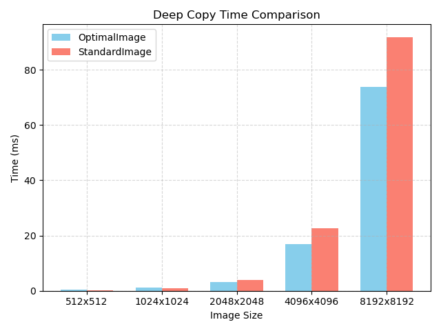

# REPORT

杨官宇涵12313614

由于设计到的代码文件较多，一共有三个文件，具体代码请参阅我的github

~~~
christylinux@christywindowscomputer:~/CS219/project4$ l
OpencvExample/  mylib/  optimallib/
~~~

[YangGuanyuhan/CS219-project](https://github.com/YangGuanyuhan/CS219-project)

## 1.设计理念

有一点值得注意，对于读取图像的函数imread这个函数在 **`opencv2/imgcodecs.hpp`** 中声明，所以这并不是mat库中的读取函数，而且在上一次project中，我们手写bmp的读取真的不是一件trivial的事情，而这一次中我们的图像库需要支持jpg，bmp，png等多种格式的支持，所以在这一次的project中通过集成 `stb_image.h` 和 `stb_image_write.h`，原生支持多种常见的图像文件格式，如PNG、JPG和BMP，这样就不用考虑load和write的事情，而是专注于图像处理和图像和存储。

硬性要求

1. 既然是实现一个动态库，那我肯定要针对某些情况支持跨平台的操作
2. 可以参考cpp智能指针的设计理念，使用使用RAII技术
3. 我需要让动态库使用起来方便，设计是给普通的懂一点的代码的人写的动态库。而不是写给是复杂程序员的
4. 参考cvmat
5. 使用valgrind等工具查看内存，使得memory safe
6. 既然要安全，只是打印错误信息往往是不够的的，可以学习异常处理，throw 一些异常出来
7. Highlight the measures you took to ensure memory safety, robustness, and efficiency.对三者肯定都要给出测试的结果
8. 报告肯定要包括两方面，一方面是用户使用手册的报告，一方面是写给计算机专业人员的报告，需要讲述代码是如何实现的，代码的质量，代码的安全性，代码的效率等等

optional

1. 可以尝试和opencv的库的效率进行一个对比
2. 正确实现SIMD优化，处理不同平台和编译器的兼容性问题，确保OpenMP的正确使用，以及处理图像的边缘情况，比如不同通道数、不同数据类型的图像。此外，确保CMake配置正确，特别是在不同操作系统上生成动态库可能需要不同的设置。

## 2. 项目概述

`OptimalImageLib` 是一个使用 C++17 标准开发的图像处理库。该库旨在提供一个功能完善、高性能且易于扩展的图像处理框架。其核心设计借鉴了如 OpenCV 等成熟库的先进理念，特别强调了内存管理效率和计算性能优化。通过实现写时复制（Copy-on-Write）机制，`OptimalImageLib` 有效地减少了不必要的内存拷贝开销。同时，库内关键图像处理算法（如亮度调整、图像混合）利用了 SIMD（Single Instruction, Multiple Data）指令集（如 AVX2, SSE2）进行加速，并结合 OpenMP 实现多线程并行处理（如高斯模糊），以充分发挥现代多核处理器的计算能力。

该库的主要特性包括：

- **核心图像类 `OptimalImage`**：封装了图像的元数据（宽度、高度、通道数等）和像素数据。支持常见的图像通道格式，如灰度图、RGB 图像和 RGBA 图像。
- **高效内存管理 `ImageDataManager`**：作为底层的图像数据管理器，采用引用计数和写时复制（Copy-on-Write）策略，优化了图像对象的拷贝和修改操作，减少了内存占用和不必要的深拷贝。
- **图像文件I/O**：依赖轻量级的第三方库 `stb_image.h` 和 `stb_image_write.h`，支持加载和保存多种主流图像格式，包括 PNG、JPG 和 BMP。
- **基础图像处理操作**：
  - 亮度调整 (`adjustBrightness`)：线性增加或减少图像亮度。
  - 图像混合 (`blend`)：按指定权重混合两张图像。
  - 高斯模糊 (`gaussianBlur`)：应用高斯滤波器对图像进行平滑处理。
- **构建系统与优化配置**：采用 CMake 作为构建系统，能够自动检测并配置编译器以启用 OpenMP 并行计算和多种 SIMD 指令集（优先顺序：AVX2, AVX, SSE4.2），从而在支持的硬件上获得显著的性能提升。

## 3. 代码架构设计

```
pgsql复制编辑+--------------------------+
|    图像加载与保存模块     |
|  stb_image / stb_write  |
+------------+-------------+
             |
+------------v-------------+
|     OptimalImage 类      |
|  - 图像封装              |
|  - Copy-on-Write         |
|  - 像素访问与处理接口     |
+------------+-------------+
             |
+------------v-------------+
| 图像处理模块 (Ops 实现)   |
| - adjustBrightness       |
| - blend                  |
| - gaussianBlur 等        |
+------------+-------------+
             |
+------------v-------------+
|   内部数据管理 (ImageDataManager)  |
| - 引用计数与内存管理       |
| - 数据共享                 |
+--------------------------+
```

1. **`ImageDataManager`（图像数据管理器）**
   - 负责像素数据的分配与释放，使用 `std::unique_ptr` 实现内存自动管理。
   - 引用计数基于 `std::atomic<int>`，实现高效的数据共享和写时复制（Copy-on-Write）。
2. **`OptimalImage`（图像对象）**
   - 用户交互主接口，封装图像维度、步长及 `ImageDataManager` 的智能指针。
   - 拷贝构造为浅拷贝，`clone()` 提供深拷贝支持。
   - 所有写操作前调用 `copyOnWrite()`，避免修改共享数据。
   - 提供如 `adjustBrightness()` 等图像处理方法，像素访问接口 `at()`，并支持图像的加载与保存。
   - 内建异常机制增强健壮性。
3. **图像处理模块 (`optimal_image_ops.cpp`)**
   - 实现具体图像算法，支持 **SIMD 加速** 和 **OpenMP 并行化**，在大图像处理时提升性能。
4. **构建系统（CMake）**
   - 使用 CMake 管理编译流程，支持 C++17，自动检测 SIMD 和 OpenMP 支持。
   - 构建共享库并生成测试和演示程序。
5. **第三方库集成**
   - 集成 `stb_image` 与 `stb_image_write` 实现高效图像文件 I/O，简化开发流程。

## 4. 学习opencv库的使用

因为是需要自己完成一个动态库，所以第一步我的选择是使用opencv的库，看一下如何写cmake，如何使用动态库来完成一些基础的操作以及相关的时间是多少。

~~~
#include <opencv2/opencv.hpp>
~~~

opencv库很方便只需要include，之后就能够进行相应的操作

只需要定义相关的变量，我就能够轻松的创建图片，并且进行随机的填充，之后也会使用这些随机生成的图形进行性能测试

~~~cpp
// 图像尺寸
    int width = 1024;
    int height = 1024;
    // 创建两个随机彩色图像
    cv::Mat img1(height, width, CV_8UC3);
    cv::Mat img2(height, width, CV_8UC3);
// 填充随机像素（0 ~ 255）
    cv::randu(img1, cv::Scalar::all(0), cv::Scalar::all(255));
    cv::randu(img2, cv::Scalar::all(0), cv::Scalar::all(255));
~~~


同时在opencv中也呢个够很轻易的对图像的亮度进行调整

~~~cpp
  // 调整 img1 亮度（加上一个固定值）
    int brightness = 50;
    cv::Mat brightened;
    img1.convertTo(brightened, -1, 1, brightness); // alpha=1, beta=brightness
    cv::imwrite("brightened_image1.bmp", brightened);
~~~

和显然能够亮了一点


同时也能够很方便的加载本地的图片

~~~
Mat img3 = imread("shark.jpg");
    Mat img4 = imread("wave.jpg");

    // 检查图像是否成功加载
    if (img3.empty() || img4.empty()) {
        std::cerr << "无法加载图像文件。" << std::endl;
        return -1;
    }
~~~

加载之后可以轻松的进行图像的混合操作,如果size不同能够轻松resize之后合并

~~~
 // 如果尺寸不同，调整为相同大小
    if (img3.size() != img4.size()) {
        cv::resize(img4, img4, img3.size());
    }
    //输出resize的图像
    cv::imwrite("resized_wave.jpg", img4);
    // 图像混合（平均）
    cv::Mat blended;
    cv::addWeighted(img3, 0.5, img4, 0.5, 0.0, blended);
~~~

例如


二者之间resize后能够得到


## 5. 参考mat库学习一些设计理念

1. ref count这样能够避免不必要的内存复制，提高性能。而需要深拷贝的时候

~~~
Mat b = a.clone();

~~~

2. 本质就是一个矩阵，只是加了一个很好的结构对他进行封装，使得正如bilibili中和opncv的负责人的对话中所说的，使用这种标准容器能够最大的可能保护内存安全
3. 强类型 + 灵活的数据访问，图像每个像素的通道类型、数量用 `type()` 统一编码，如 `CV_8UC3` 表示 8 位无符号整型、3 通道图像。这个可以学习
4. 可以和多个接口集成，所以我的代码中也要和一些常用库集成
5. 严格的RAII 机制，所以我的代码中严格使用rall的理念

## 6. OptimalImageLib 用户使用手册

### 1. 简介

OptimalImageLib 是一个C++图像处理库，旨在提供高效的图像操作功能。参考了OpenCV的设计理念，注重性能优化，支持数据共享（写时复制机制）以减少不必要的内存拷贝，并利用SIMD（单指令多数据）指令集（如AVX2, AVX, SSE4.2）和OpenMP进行并行计算加速。

该库提供了一个核心类 `mylib::OptimalImage` 用于图像数据的表示和操作，以及一系列图像处理函数，如亮度调整、图像混合和高斯模糊等。同时，库中包含了stb_image.h和stb_image_write.h，用于加载和保存多种常见的图像格式。

### 2. 特性

- **高效的内存管理**：采用写时复制（Copy-on-Write）的共享数据模型，减少深拷贝开销。
- 多种图像操作
  - 创建、加载（PNG, JPG, BMP等）、保存图像。
  - 访问和修改像素数据。
  - 调整图像亮度。
  - 图像混合。
  - 高斯模糊。
- 性能优化
  - 自动检测并启用CPU支持的SIMD指令集 (AVX2, AVX, SSE4.2) 进行加速。
  - 支持OpenMP并行处理，进一步提升运算速度。
- **跨平台构建**：使用CMake进行项目构建，方便在不同操作系统上编译。
- **异常处理**：定义了专门的异常类，方便错误处理。
- **示例和性能测试**：提供 `demo.cpp` 展示库功能，以及 `performancetest.cpp` 用于评估操作性能。

### 3. 开始使用

#### 3.1 先决条件

- C++17 编译器 (如 GCC, Clang, MSVC)。
- CMake (版本 3.10 或更高)。
- (可选) OpenMP：如果需要并行处理功能，确保编译器支持OpenMP。CMake会自动检测。

#### 3.2 构建库 (OptimalImageLib)

1. 创建构建目录：

   在项目根目录下创建一个构建目录（例如 build）并进入该目录：

   Bash

   ```
   mkdir build
   cd build
   ```

2. **运行CMake生成构建系统**：

   Bash

   ```
   cmake ..
   ```

   CMake会自动检测编译器、OpenMP支持和可用的SIMD指令集 。

3. 编译库：

   根据你的构建系统（例如 Makefiles, Visual Studio projects 等）执行编译命令。

   - 对于 Makefiles (Linux/macOS):

     ```
     make
     ```

   - 对于 Visual Studio (Windows): 打开生成的 `.sln` 文件并编译 `optimal_image` 项目。

   编译成功后，动态库（例如 `liboptimal_image.so` 或 `optimal_image.dll`）将生成在构建目录下的 `lib` 子目录中 。头文件 `optimal_image.h` 可以用于链接到你的项目中。

#### 3.3 构建并运行演示程序 (`demo`)

演示程序 (`demo.cpp`) 展示了库的各项核心功能。

1. 确保库已经成功构建。

2. make demo

   - 对于 Visual Studio: 编译 `demo` 项目。

3. 运行演示程序： 可执行文件通常生成在构建目录的 

   ```
   bin
   ```

    子目录中（取决于CMake配置，在此项目中是 

   ```
   bin
   ```

   ```
   ./bin/demo
   ```

   或者在Windows上：

   ```
   .\bin\demo.exe
   ```

   演示程序会创建测试图像、加载图像文件（需要 

   ```
   resources
   ```

    目录下的 

   ```
   shark.jpg
   ```

    和 

   ```
   wave.jpg
   ```

### 4.常用方法

#### 新建一个图像

~~~
mylib::OptimalImage img(width, height, channels);
~~~

~~~
mylib::OptimalImage img1 = createTestImage(800, 600, 3);
~~~

#### 显示图像的基本信息

~~~
 printImageInfo(img1, "原始图像 (程序创建)")
~~~

能够得到，进而观测图像的基本信息

~~~
图像信息 '原始图像 (程序创建)':
  - 大小: 800x600
  - 通道数: 3
  - 内存大小: 1440000 字节
  - 步长: 2400 字节/行
  - 是否为空: 否
  - 引用计数: 1
~~~

#### load外部的图像，支持jpg，png，bmp

~~~
mylib::OptimalImage loaded_png("created_image.png");
            printImageInfo(loaded_png, "从PNG加载的图像");

            mylib::OptimalImage loaded_jpg("created_image.jpg");
            printImageInfo(loaded_jpg, "从JPG加载的图像");
~~~

#### deepcopy

~~~
shark_img.clone(); // 创建副本以保持原始图像不变
~~~

#### 调整图像的亮度

~~~
brightened_shark.adjustBrightness(30); // 提高亮度
~~~

对于


能够得到


#### 进行图像的混合

混合两个图像，其中`alpha` – 混合比例，取值范围[0, 1]

~~~
mylib::OptimalImage blended = mylib::OptimalImage::blend(wave_img, shark_img, 0.5f);
~~~

对于


更改不同的参数能够得到不同的图像

这是参数为0.3的


这是参数为0.8的


#### 高斯模糊

~~~
mylib::OptimalImage blurred = img.gaussianBlur(5, 1.5);
~~~


#### 同时demo中还有检测异常问题的小测试

~~~

        // 测试错误处理
        std::cout << "测试错误处理..." << std::endl;
        try
        {
            // 尝试访问越界元素
            std::cout << "尝试访问越界元素..." << std::endl;
            unsigned char pixel = movedImg.at(1000, 1000, 0);
            // 这行代码不应该被执行
            std::cout << "越界访问没有抛出异常！像素值: " << static_cast<int>(pixel) << std::endl;
        }
        catch (const mylib::OutOfRangeException &e)
        {
            std::cout << "捕获到预期的异常: " << e.what() << std::endl;
        }
  // 测试成功
        std::cout << std::endl
                  << "=== 演示完成 ===" << std::endl;
        return 0;
    }
    catch (const mylib::ImageException &e)
    {
        std::cerr << "图像处理异常: " << e.what() << std::endl;
    }
    catch (const std::exception &e)
    {
        std::cerr << "标准异常: " << e.what() << std::endl;
    }
    catch (...)
    {
        std::cerr << "未知异常!" << std::endl;
    }

    return 1;
}
~~~

~~~

测试错误处理...
尝试访问越界元素...
捕获到预期的异常: Index out of range: Row index 1000 out of range [0, 99]
尝试用无效的alpha值进行混合...
捕获到预期的异常: Invalid argument: Alpha must be in range [0, 1], but got 2
~~~


### 5. 核心类: `mylib::OptimalImage`

`mylib::OptimalImage` 是图像处理的核心类，封装了图像数据和相关操作。

#### 4.1 构造函数

- **`OptimalImage()`**: 默认构造函数，创建一个空的图像对象。

- `OptimalImage(int width, int height, int channels)`

  : 创建一个指定宽度、高度和通道数的图像。数据会被初始化为0。

  - `width`: 图像宽度（像素）。
  - `height`: 图像高度（像素）。
  - `channels`: 通道数 (例如：1代表灰度图, 3代表RGB, 4代表RGBA)。

- `OptimalImage(const std::string &filename)`

  : 从文件加载图像。

  - `filename`: 图像文件路径。支持PNG, JPG, BMP等常见格式，具体依赖于 `stb_image.h`。

- **`OptimalImage(const OptimalImage &other)`**: 拷贝构造函数。创建一个引用相同图像数据的对象（浅拷贝），并通过引用计数管理数据。

- **`OptimalImage(OptimalImage &&other) noexcept`**: 移动构造函数。

#### 4.2 基本属性

- **`int width() const`**: 获取图像宽度。
- **`int height() const`**: 获取图像高度。
- **`int channels() const`**: 获取图像通道数。
- **`size_t size() const`**: 获取图像数据总大小（字节数），计算方式为 `height * step`。
- **`size_t step() const`**: 获取图像一行数据的字节数。为了内存对齐和访问效率，步长可能大于 `width * channels`。
- **`bool empty() const`**: 判断图像是否为空（未初始化或无数据）。

#### 4.3 数据访问

- **`unsigned char \*data()`**: 获取图像数据的指针（可修改）。如果图像数据被多个对象共享，在首次尝试修改前会触发写时复制。
- **`const unsigned char \*data() const`**: 获取图像数据的常量指针（不可修改）。
- **`unsigned char &at(int row, int col, int channel = 0)`**: 访问指定位置的像素值（可修改）。会进行边界检查。
- **`const unsigned char &at(int row, int col, int channel = 0) const`**: 访问指定位置的像素值（常量版本）。会进行边界检查。

#### 4.4 内存管理 (数据共享与写时复制)

`OptimalImage` 内部使用 `std::shared_ptr<ImageDataManager>` 来管理实际的图像数据。

- **共享数据**：当通过拷贝构造函数或赋值运算符创建 `OptimalImage` 对象时，它们会共享相同的底层图像数据，引用计数增加。这避免了不必要的数据复制，提高了效率。
- **写时复制 (Copy-on-Write)**：当需要修改一个共享数据的图像时（例如通过非 `const` 的 `data()` 或 `at()` 方法），如果该数据的引用计数大于1，库会自动创建一个新的数据副本。这样，修改操作只会影响当前对象，不会影响其他共享同一旧数据的对象。
- **`OptimalImage clone() const`**: 创建一个图像的深拷贝。新图像将拥有独立的数据副本，即使原始图像被修改，克隆体也不会受影响。
- **`int refCount() const`**: 获取当前图像数据的引用计数。
- **`void release()`**: 减少图像数据的引用计数。如果计数降为0，则释放数据。析构函数会自动调用此方法。

#### 4.5 文件操作

- `void load(const std::string &filename)`

  : 从文件加载图像。支持的格式由 

  ```
  stb_image.h
  ```

   决定 (如 PNG, JPG, JPEG, BMP)。

  - 如果加载失败（文件不存在、格式不支持等），会抛出 `mylib::OperationFailedException` 或 `mylib::InvalidArgumentException`。

- `void save(const std::string &filename) const`

  : 将图像保存到文件。

  - 文件格式会根据扩展名自动推断 (支持 "png", "jpg", "jpeg", "bmp")。
  - JPG格式保存时默认质量为95%。
  - 如果图像为空或保存失败，会抛出 `mylib::OperationFailedException` 或 `mylib::InvalidArgumentException`。

### 6. 图像处理操作

这些操作通常是 `OptimalImage` 类的成员函数或静态成员函数。

- `void adjustBrightness(int delta)`

  : 调整图像亮度。

  - `delta`: 亮度增量，取值范围 `[-255, 255]`。
  - 此操作会修改当前图像数据（如果共享则触发写时复制）。
  - 针对AVX2和SSE2指令集以及OpenMP进行了优化。

- `static OptimalImage blend(const OptimalImage &img1, const OptimalImage &img2, float alpha)`

  : 将两张图像混合。

  - `img1`, `img2`: 要混合的两张图像，它们必须具有相同的尺寸和通道数。
  - `alpha`: 混合比例，取值范围 `[0.0, 1.0]`。结果 = `alpha * img1 + (1 - alpha) * img2`。
  - 返回一个新的 `OptimalImage` 对象，包含混合后的结果。
  - 针对AVX2和SSE2指令集以及OpenMP进行了优化。

- `OptimalImage gaussianBlur(int kernelSize, double sigma) const`

  : 对图像应用高斯模糊。

  - `kernelSize`: 卷积核大小，必须是正奇数 (如 3, 5, 7)。
  - `sigma`: 高斯函数的标准差。
  - 返回一个新的 `OptimalImage` 对象，包含模糊后的结果。
  - 使用OpenMP进行优化。

### 7. 异常处理

`OptimalImageLib` 定义了一系列异常类，继承自 `std::runtime_error`，用于报告图像处理过程中发生的错误：

- **`mylib::ImageException`**: 图像处理库异常的基类。
- **`mylib::InvalidArgumentException`**: 当函数参数无效时抛出 (例如，创建图像时尺寸为负，文件名为空等)。
- **`mylib::OutOfRangeException`**: 当像素访问越界时抛出 (例如，`at(row, col, channel)` 的索引超出图像范围)。
- **`mylib::OperationFailedException`**: 当图像操作失败时抛出 (例如，文件加载失败、保存失败、内存分配失败等)。

在调用库函数时，建议使用 `try-catch` 块来捕获这些异常。

C++

```
try {
    mylib::OptimalImage img("non_existent_image.jpg");
    // ... some operations ...
} catch (const mylib::ImageException &e) {
    std::cerr << "Image processing error: " << e.what() << std::endl;
} catch (const std::exception &e) {
    std::cerr << "Standard error: " << e.what() << std::endl;
}
```

### 8. CMake 构建配置 (`CMakeLists.txt`)

`CMakeLists.txt` 文件定义了如何构建 `OptimalImageLib` 库以及相关的演示和测试程序。

- **项目名称和版本**: `project(OptimalImageLib VERSION 1.0.0 LANGUAGES CXX)`。
- **C++ 标准**: 设置为 C++17 (`set(CMAKE_CXX_STANDARD 17)`) 。
- **OpenMP 检测**: 使用 `find_package(OpenMP)` 查找并启用OpenMP。如果找到，相关的编译和链接标志会被添加。
- SIMD 支持
  - 在MSVC编译器下，默认启用 AVX2 (`/arch:AVX2`)。
  - 在其他编译器（如GCC, Clang）下，会检查对 `-mavx2`, `-mavx`, `-msse4.2` 的支持，并启用最优的可用选项 。
  - 编译时会输出找到的SIMD支持级别。
- 库构建
  - 源文件: `optimal_image.cpp`, `optimal_image_ops.cpp`。
  - 类型: 共享库 (`SHARED`)。
  - 公共头文件: `optimal_image.h`。
- 可执行文件
  - `demo`: 链接 `optimal_image` 库。
  - `performancetest`: 链接 `optimal_image` 库。
- **安装**: 配置了库和头文件的安装路径，方便在系统中使用。
- **测试**: 启用了CTest，并将 `demo` 添加为一个简单的测试用例。

### 9.  包含的第三方库

OptimalImageLib 直接在其源代码中包含了以下广泛使用的单头文件库：

- `stb_image.h`

  : 用于加载多种图像格式（PNG, JPEG, BMP, GIF, PSD, TGA, HDR, PIC, PNM）。

  - 在 `optimal_image.cpp` 中定义了 `STB_IMAGE_IMPLEMENTATION` 来包含其实现。

- `stb_image_write.h`

  : 用于将图像数据写入文件（PNG, BMP, TGA, JPEG, HDR）。

  - 在 `optimal_image.cpp` 中定义了 `STB_IMAGE_WRITE_IMPLEMENTATION` 来包含其实现。

这两个库被封装在 `OptimalImage::load()` 和 `OptimalImage::save()` 方法中，为用户提供了便捷的图像文件I/O功能。

## 7. 优化手段（some highlight）

**自动检测平台实现**

- 自动检测系统是否支持 OpenMP，并在支持的情况下启用相关的编译器标志和链接库。
- 自动检测编译器对不同级别 SIMD 指令集（AVX2, AVX, SSE4.2）的支持，并根据检测结果动态添加相应的编译选项，以确保生成的库能够利用硬件的最佳性能。

**内存对齐与行步长 (`step_`)**：

- 在 `create()` 方法中，计算图像每行的字节数（行步长 `step_`）时，会确保该值是4字节的倍数。具体计算为 `newStep = ((static_cast<size_t>(width) * channels + 3) / 4) * 4;`。这种对齐方式可以提高某些硬件平台上内存访问的性能，尤其对于SIMD操作可能更为友好。

**图像加载 (`load`)**：

- 加载成功后，`OptimalImage` 会根据图像的实际宽度、高度、通道数以及计算得到的对齐行步长 `newStep` 来创建或重新分配内部的 `ImageDataManager`。
- 如果 `newStep` (对齐后的行字节数) 等于 `img_width * img_channels` (原始加载数据的行字节数)，则可以进行一次性的 `std::memcpy`。
- 否则（即需要填充字节以满足对齐要求），则需要逐行将加载的像素数据复制到新分配的、具有正确行步长的内存中。
- 加载失败或内存分配失败会抛出相应的异常。

**写时复制 (`copyOnWrite`) 机制**：

- 如果引用计数大于1，表示当前的像素数据正被多个 `OptimalImage` 对象共享。为了避免修改影响其他对象，此时会：
  1. 创建一个新的 `ImageDataManager` 实例，其大小与当前图像数据相同。
  2. 使用 `std::memcpy` 将当前 `dataManager_` 中的像素数据完整复制到新的 `ImageDataManager` 中。
  3. 调用旧 `dataManager_` 的 `release()` 方法，减少其引用计数。
  4. 将当前 `OptimalImage` 对象的 `dataManager_` 指向这个新创建并包含数据副本的 `ImageDataManager`。
- 这样，后续的修改操作就会在当前对象独有的数据副本上进行，不会影响其他之前共享数据的对象。

**SIMD 实现 (AVX2 / SSE2)**：

- 仅当通道数为1（灰度）、3（RGB）或4（RGBA）时启用。
- 使用 `_mm256_set1_epi8` (AVX2) 或 `_mm_set1_epi8` (SSE2) 创建一个SIMD向量，其中每个字节元素都填充为 `delta` 值。
- 以SIMD向量宽度（AVX2为32字节，SSE2为16字节）为单位，循环处理图像数据：
  - `_mm256_loadu_si256` / `_mm_loadu_si128`：加载未对齐的像素数据到SIMD寄存器。
  - `_mm256_adds_epu8` / `_mm_adds_epu8`：执行饱和的无符号字节加法。饱和加法确保结果不会溢出0-255的范围（例如，250 + 20 = 255，而不是回绕到较小的值）。
  - `_mm256_storeu_si256` / `_mm_storeu_si128`：将处理后的结果写回内存。
- 处理图像末尾不足一个SIMD向量长度的剩余像素时，回退到标量（逐字节）处理，并使用 `std::clamp` 确保结果在0-255之间。

**OpenMP 实现**：

- 如果SIMD优化未被启用（例如，编译器不支持或通道数不匹配），则使用OpenMP。
- `#pragma omp parallel for if(pixelCount > 10000)`：对图像的行进行并行处理。`if(pixelCount > 10000)` 子句表示只有当总像素数（宽*高）大于10000时才启用并行化，以避免在小图像上因线程创建和同步的开销超过并行带来的收益。
- 内部循环遍历行内的像素和通道，进行标量加法和 `std::clamp`。

**cmake**

- **C++ 标准**：项目设置为使用 C++17 标准 (`set(CMAKE_CXX_STANDARD 17)`)。

- **OpenMP 支持**：通过 `find_package(OpenMP)` 自动查找系统中的 OpenMP 库。如果找到，相关的编译器和链接器标志 (`OpenMP_CXX_FLAGS`) 会被添加到项目中，并且 `optimal_image` 库会链接到 `OpenMP::OpenMP_CXX` 目标。构建时会输出 OpenMP 是否找到的状态信息。

- **SIMD 指令集支持**：

  - **MSVC (Microsoft Visual C++ Compiler)**：如果检测到是 MSVC 编译器，直接添加 `/arch:AVX2` 编译选项以启用 AVX2 指令集支持。

  - **GCC/Clang**：对于 GCC 和 Clang 编译器，使用 CMake 的 `CheckCXXCompilerFlag` 模块来检测编译器是否支持特定的 SIMD 标志。它会按以下顺序检查并启用第一个支持的标志：

    1. `-mavx2` (AVX2 指令集)

    2. `-mavx` (AVX 指令集)

    3. -msse4.2 (SSE4.2 指令集)

       构建时会输出启用的 SIMD 支持级别。

  - 默认添加 `-g` 选项以包含调试信息，以及 `-Wall -Wextra -Wpedantic` 等警告选项（非MSVC）。

## 8. 内存使用分析

因为写了两个库，所以对于两个库都进行了内存分析

对于第一个

使用valgrind工具进行内存分析

~~~
=== 演示完成 ===
==186648== 
==186648== HEAP SUMMARY:
==186648==     in use at exit: 0 bytes in 0 blocks
==186648==   total heap usage: 87,953 allocs, 87,953 frees, 41,606,558 bytes allocated
==186648== 
==186648== All heap blocks were freed -- no leaks are possible
==186648== 
==186648== For lists of detected and suppressed errors, rerun with: -s
==186648== ERROR SUMMARY: 0 errors from 0 contexts (suppressed: 0 from 0)
~~~

可以看出，因为是使用deepcopy，所以内存很安全

对于第二个使用valgrind

~~~
LEAK SUMMARY:
==190283==    definitely lost: 0 bytes in 0 blocks
==190283==    indirectly lost: 0 bytes in 0 blocks
==190283==      possibly lost: 10,416 bytes in 31 blocks
==190283==    still reachable: 9,328 bytes in 5 blocks
==190283==         suppressed: 0 bytes in 0 blocks
==190283== Reachable blocks (those to which a pointer was found) are not shown.
==190283== To see them, rerun with: --leak-check=full --show-leak-kinds=all
==190283== 
==190283== For lists of detected and suppressed errors, rerun with: -s
==190283== ERROR SUMMARY: 1 errors from 1 contexts (suppressed: 0 from 0)
~~~

valgrind说可能会丢失

之后我一直在找究竟是哪里可能出问题呢，百思不得其解，因为我已经遵循了rall的理念，然后使用了智能指针，我真的找不到什么地方居然可能泄露。之后我问了gemini，得出以下的解释

- 正如之前的分析，Valgrind 的堆栈跟踪明确指出这些 "possibly lost" 的内存块是在 OpenMP (`libgomp.so.1.0.0`) 的并行区域内，由 `pthread_create` 调用的。这通常与 OpenMP 运行时为其线程池中的线程分配资源（如线程局部存储、栈空间等）有关。

- 对于 OpenMP 这样的并行运行时库，它们通常会维护一个线程池。这些线程及其相关资源（包括 Valgrind 报告中提到的内存）可能会在程序的整个生命周期内保持活动状态，直到程序结束。Valgrind 可能无法完全跟踪这些库内部复杂的生命周期管理，从而将这些块报告为 "possibly lost"。

因为还使用了标准库，所以很复杂，我认为是omp的副产品而不是直接的内存泄漏

对于 OpenMP 这样的并行运行时库，它们通常会维护一个线程池。这些线程及其相关资源（包括 Valgrind 报告中提到的内存）可能会在程序的整个生命周期内保持活动状态，直到程序结束。Valgrind 可能无法完全跟踪这些库内部复杂的生命周期管理，从而将这些块报告为 "possibly lost"。

## 9. 性能测试

对于读取时间


因为对于这一方面做的优化较少，并没有明显的提升

而对于deepcopy



因为来到deepcopy，可以并行执行所以有一点点的优化

而对于调整亮度，这是一个优化的甜区，因为同时拥有simd和多线程，使得在面对8192*8192的图片时，提升恐怖，说明他们对于大数据的支持格外强力


性能总结

如果你的应用需要处理 **大图像** 或执行 **复杂图像操作（如模糊、滤波等）**，应优先使用 **OptimalImage**；

如果只是轻量级处理或在资源受限设备上运行，StandardImage 可作为简化版本使用；

**OptimalImage 的 SIMD + OpenMP 加速机制在现代多核 CPU 上能大大提升效率**，是性能敏感项目的更优选择。

## 10.异常处理

| 异常类                            | 继承自                  | 描述                                                         |
| --------------------------------- | ----------------------- | ------------------------------------------------------------ |
| `mylib::ImageException`           | `std::runtime_error`    | 图像处理库中所有自定义异常的基类。                           |
| `mylib::InvalidArgumentException` | `mylib::ImageException` | 当函数参数无效时抛出。例如，创建图像时尺寸为负、文件名为空、亮度调整的 `delta` 超出范围、高斯模糊的 `kernelSize` 或 `sigma` 无效、图像混合的 `alpha` 超出范围，或图像尺寸/通道不匹配等。 |
| `mylib::OutOfRangeException`      | `mylib::ImageException` | 当像素访问越界时抛出。例如，使用 `at(row, col, channel)` 访问图像数据时，提供的行、列或通道索引超出了图像的有效范围，或者图像为空时尝试访问。 |
| `mylib::OperationFailedException` | `mylib::ImageException` | 当图像操作失败时抛出。例如，内存分配失败 (`create`、`clone` 时)、文件加载失败 (文件不存在、无法访问或 `stbi_load` 返回错误)、保存图像失败 (无法写入文件或 `stbi_write_*` 返回错误)、对空图像执行操作 (如调整亮度、高斯模糊、保存) 等。 |

## 11. 与先前BMP项目的对比与改进

相较于之前基于C语言和专注于24位未压缩BMP图像处理的项目，`StandardImageLib` 具有以下显著改进：

* **语言与范式**: 从C语言过程式编程转向C++面向对象编程，利用类、封装、继承（异常类）、构造/析构函数、智能指针等特性。
* **图像格式支持**: 通过集成 `stb_image`，从单一BMP格式支持扩展到PNG, JPG, BMP等多种格式，大大增强了库的实用性。
* **内存管理**: 使用 `std::unique_ptr` 自动管理动态分配的像素数据，减少了手动 `malloc`/`free` 带来的内存泄漏风险。
* **错误处理**: 引入了层次化的C++异常处理机制，替代了之前基于返回值和 `print_error` 的方式，使得错误处理更规范和灵活。
* **代码组织**: 将接口 (`.h`) 和实现 (`.cpp`)分离，操作函数 (`_ops.cpp`) 也独立出来，结构更清晰。
* **构建系统**: 使用CMake，提供了更标准和跨平台的构建方式。
* **API设计**: 提供了更接近现代图像库（如OpenCV）的类接口。

之前的项目集中于BMP细节处理（如文件头、信息头、行填充）和性能优化（如多线程、SIMD）方面。`stb_image` 带来了便捷性和广泛的格式支持，但可能隐藏了某些底层控制和特定格式的优化机会。

## 12. 可以改进的地方

1. 增加更多的图像处理算法，如颜色空间转换（RGB, HSV, HSL, Grayscale之间的转换
2. 对于计算量非常大的操作，可以考虑引入基于CUDA或OpenCL的GPU加速实现路径。

## 13. 总结

类与对象真的是编程的核心的一大概念，从c以方法为基础进一步优化到现在面向对象编程，一幅图片就是一个对象，可以调用他自己的私有方法进行处理，对象和对象之间也能够进行操作，如果图片再细化，还可以加上对bmp，png，jpg不同的多态的支持。面向对象与类的设计真的很聪明。但是上课说rust没有class的概念，那使用rust是会回到老式的c的那种样子呢还是对于面向对象，rust提出了新的解决方案呢

## 14. 引用

GitHub. (n.d.). *Copilot*. GitHub. Retrieved March 30, 2025, from https://github.com/settings/copilot

OpenAI. (n.d.). *ChatGPT*. OpenAI. Retrieved March 30, 2025, from https://chatgpt.com/

**nothings**. (2023). **stb** (Version 2.28) [Source code]. **https://github.com/nothings/stb/tree/master**
