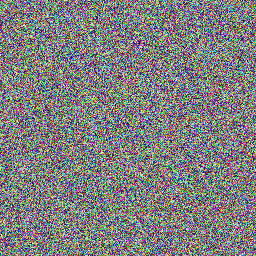
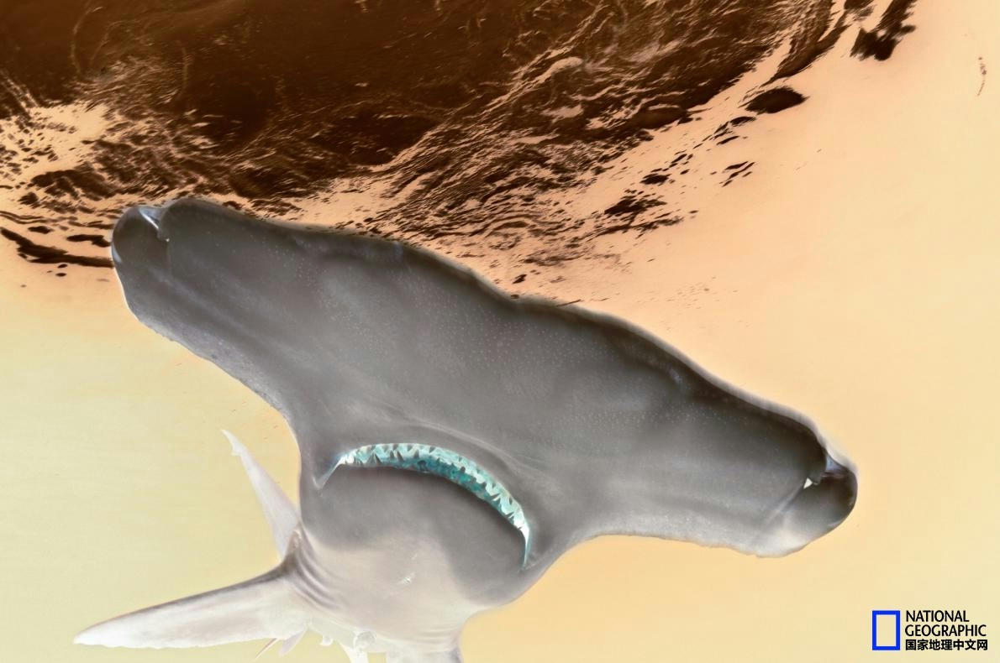
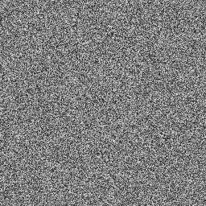
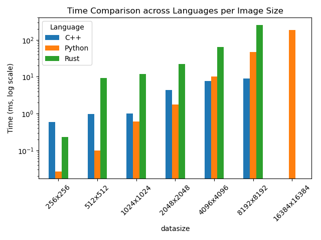
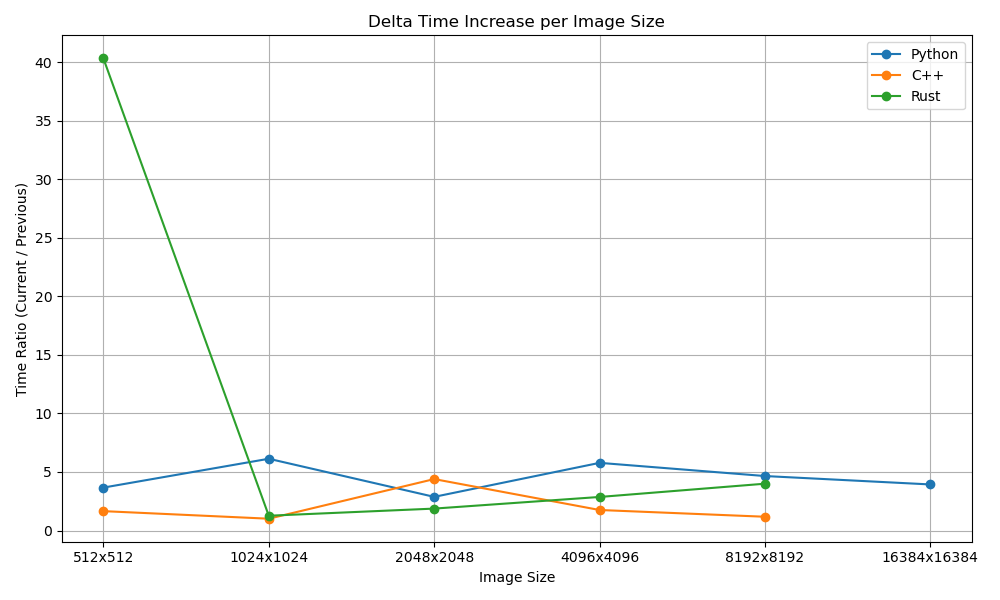
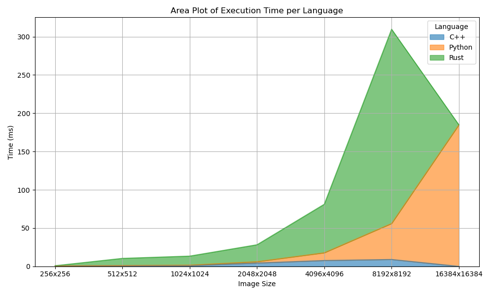
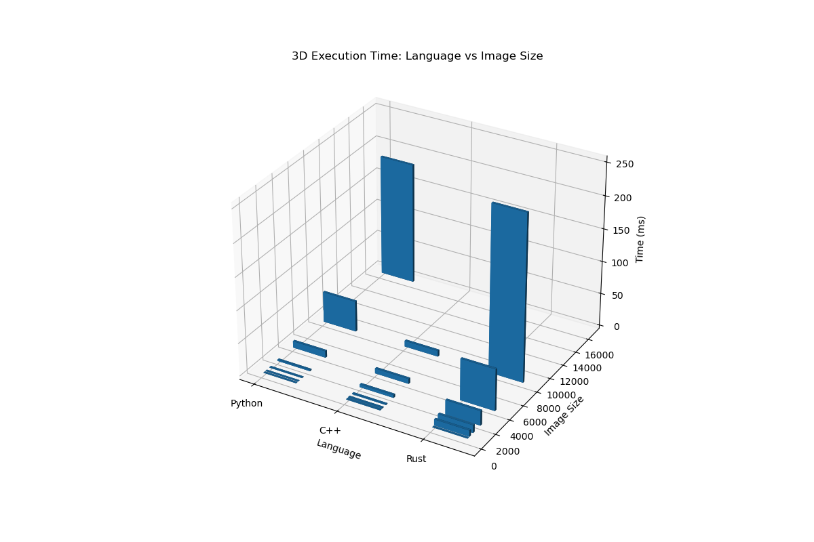
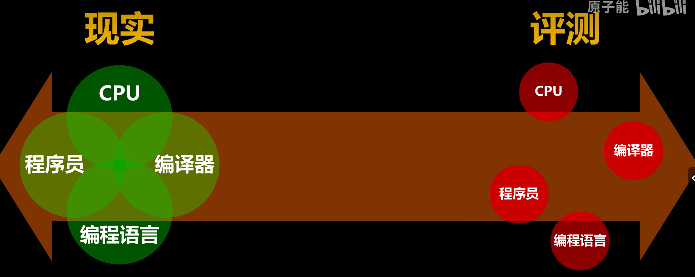

# REPORT5杨官宇涵12313614

本次提交的代码除了三个类相关的文件，还有对于每种语言还有一个文件作为使用示例

由于设计到的代码文件较多，具体代码请参阅我的github。

[YangGuanyuhan/CS219-project](https://github.com/YangGuanyuhan/CS219-project)

## 任务概述

对比 Python（OpenCV‑Python，强制使用OpenCV-Python v4.11）、C/C++（已有项目4实现）和 Rust（如 `image`, `imageproc`, `rayon` 等），在相同图像处理任务与数据规模下的：

- **开发效率**：开发时间，代码行数、实现难易度、调试成本
- **运行性能**：处理帧率、单次操作时长
- **内存管理**：峰值内存使用、GC/手动管理开销

## 设计框架

~~~
├── src/
│   ├── python/
│   │   └── process_python.py         # 封装接口，调用 OpenCV 处理
│   ├── cpp/
│   │   ├── CMakeLists.txt
│   │   └── process_cpp.cpp           # 项目4代码模块化
│   └── rust/
│       ├── Cargo.toml
│       └── src/
│           └── main.rs               # 使用 image/imageproc + rayon
├── bench/
│   └── run_bench.py                  # Python 脚本：批量调用三版本并记录结果
├── data/
│   ├── images/                       # 不同大小测试图像
│   └── results/                      # 输出的 CSV/JSON
└── report.pdf                        # 最终报告

~~~

## 代码

### rust

**正确使用了rayon来实现并行化**

~~~rust
output
    .enumerate_pixels_mut() // 可变遍历所有像素 (x, y, pixel)
    .collect::<Vec<_>>()     // 转为 Vec<(x, y, &mut pixel)>
    .par_iter_mut()          // rayon 并行遍历
    .for_each(|(x, y, pixel)| {
        ...
    });

~~~

 `.enumerate_pixels_mut()`  得到所有像素的 `(x, y, &mut pixel)` 可变引用。 `.collect::<Vec<_>>()`     将这些迭代项收集成一个 `Vec`，为了让 Rayon 能用 `.par_iter_mut()`。  `.par_iter_mut()`          使用 **Rayon 的并行迭代器** 来并发处理每个像素。  `.for_each(...)` 并发执行闭包，对每个像素进行亮度调整处理。   

**有选择的使用串行化**                

对于rust单个语言对于并行和串行的优化程度，发现在数据量较小的时候，并行化比普通的代码还慢很多，所以我进一步优化我的代码，在数据量较小的时候使用普通的调整也就是串行，只有在数据量足够大的时候才使用并行化加速代码

添加一个阈值来决定是否使用并行化。当像素数量小于阈值时使用普通迭代器，当像素数量大于阈值时使用并行迭代器。

~~~
    // 并行化阈值：当像素数量超过此值时才使用并行处理
    const PARALLEL_THRESHOLD: u32 = 100_000; // 100K像素
~~~

~~~
// 根据像素数量决定是否使用并行处理
        if pixel_count > Self::PARALLEL_THRESHOLD {
~~~

### python

设计了一个图像处理类，封装了一下opencv的方法，为了安全性

| 功能     | 描述                                                       |
| -------- | ---------------------------------------------------------- |
| 图像加载 | 支持加载本地图像文件（路径验证 + OpenCV读取）              |
| 图像验证 | 验证图像是否为有效的 `numpy.ndarray`                       |
| 亮度调整 | 可调节亮度因子，范围 0.0–2.0（使用 `cv2.convertScaleAbs`） |
| 图像混合 | 与另一张图像按比例混合（`cv2.addWeighted`）                |
| 高斯模糊 | 应用 `cv2.GaussianBlur`，支持设置核大小和标准差            |
| 图像保存 | 保存为 JPEG 或 PNG，并可指定图像质量                       |
| 图像信息 | 返回图像的尺寸、通道、数据类型等信息                       |
| 原图还原 | 支持重置为最初加载的图像（用于测试多个效果）               |
| 链式调用 | 所有操作支持链式调用（如 `a.adjust().blur().save()`）      |
| 错误处理 | 自定义异常类 `ImageProcessingError`，统一抛出异常          |

调用实例

~~~
processor = OptimalImage("./input/shark.jpg")
processor.adjust_brightness(1.2).save_image("./output/bright_shark.jpg")
processor.reset_to_original().blend_with_image("./input/wave.jpg").save_image("./output/blend_image.jpg")

~~~


## 代码安全性说明

### python代码安全说明


1. **路径验证**: 防止路径遍历攻击
2. **参数检查**: 所有参数都经过严格验证
3. **异常处理**: 完善的错误处理机制
4. **内存安全**: 避免空指针和内存泄漏

程序使用logger.error输出错误信息，便于调试

~~~
logging.basicConfig(level=logging.INFO, format='%(asctime)s - %(levelname)s - %(message)s')
logger = logging.getLogger(__name__)
~~~

模块定义了自定义异常 `ImageProcessingError`，所有图像处理相关的错误都会抛出这个异常：

```python
try:

  img = OptimalImage("invalid_path.jpg")

except ImageProcessingError as e:

  print(f"处理错误: {e}")

```

### rust安全性说明

- 所有图像操作使用的是 `image` 和 `imageproc` crate，它们均采用安全 API；

- 图像数据如 `ImageBuffer` 是 `Vec<u8>` 封装，自动管理内存；

- 未使用 `unsafe`，所以**内存是绝对安全的**。

- `RgbImage` 和 `ImageBuffer` 实现了 `Send + Sync`；

  使用 `par_iter_mut()` 时，元素为 `&mut (u32, u32, &mut Rgb<u8>)`，内部不可重入，但 rayon 自动保证每个元素独立。

  `enumerate_pixels_mut()` 返回图像中所有像素的可变引用；

  代码中使用 `.collect::<Vec<_>>()` 把 `(x, y, pixel_mut)` 收集到 `Vec`；

  然后通过 `.par_iter_mut()` 并发处理每个像素的值；

  每个线程处理不同的像素位置，**不会产生数据竞争**。

  使用 `get_pixel(x, y)`：此方法是安全的，内部自动进行坐标范围检查；

  `adjust_*` 等函数都避免了手动数组索引；

  所有写入都基于 `.enumerate_pixels_mut()`，不涉及越界访问。

  所有函数返回 `anyhow::Result`，调用者可以使用 `?` 操作符进行错误传播；

  失败的情况都有详尽的 `anyhow::anyhow!(...)` 报错；

  所以无 panic 风险（除非外部库 panic，这种情况属于非预期异常）。

## 功能说明

### rust代码功能说明

原图



**调整亮度**


**混合图片**


**高斯模糊**


**调整对比度**


**颜色反转**



**灰度**



### python代码功能说明


- **亮度调整**: 安全的图像亮度调整功能
- **图像混合**: 两张图像的Alpha混合
- **高斯模糊**: 可配置的高斯模糊效果
- **链式调用**: 支持方法链式调用
- **错误处理**: 完善的异常处理机制
- **安全验证**: 防止路径遍历等安全漏洞
- **参数验证**: 所有输入参数的有效性检查

使用教程


```python
from performance import OptimalImage

# 加载图像
img = OptimalImage("./input/image.jpg")

# 调整亮度
img.adjust_brightness(1.2)

# 保存结果
img.save_image("./output/bright_image.jpg")
```

链式调用

``` python

 一行代码完成多个操作

(OptimalImage("./input/image.jpg")

 .adjust_brightness(0.9)

 .gaussian_blur(7, 1.5)

 .save_image("./output/processed.jpg"))

```


## 方法

### 公平性保证

1. 为了测试的公平性我了解到OpenCV-Python在 **默认情况下确实会自动使用 SIMD 和多线程加速**。比如TBB / OpenMP / 自带线程池等等。而我自己写的cpp的库也是使用omp和simd，能够对并行场景有很好的加速支持。所以rust中我也要显式使用simd和多线程

### 测试结果代表性

| 操作类型 | 是否并行友好 | 依赖关系     | 简介                                                   |
| -------- | ------------ | ------------ | ------------------------------------------------------ |
| 调整亮度 | 非常友好     | 每个像素独立 | 每个像素加上/乘以一个常数，无需考虑其他像素            |
| 图像混合 | 非常友好     | 同位置像素   | 两张图中同一个位置的像素混合，无交叉干扰               |
| 高斯模糊 | 有挑战       | 局部邻域依赖 | 每个像素依赖其邻域像素，不能完全独立处理，边界处理复杂 |

选取两个并行友好的和一个相对来说有挑战的来加深不同编程语言之间的差异

### 实现环境与依赖

~~~
**python环境依赖**

**图像处理模块依赖**
opencv-python>=4.5.0
numpy>=1.20.0
~~~

~~~
设备名称	christywindowscomputer
处理器	13th Gen Intel(R) Core(TM) i9-13900HX   2.20 GHz
机带 RAM	16.0 GB (15.7 GB 可用)
设备 ID	E57C76E3-CD9E-4C4C-A6B5-AC733E4CF6CC
产品 ID	00342-31475-80601-AAOEM
系统类型	64 位操作系统, 基于 x64 的处理器
笔和触控	没有可用于此显示器的笔或触控输入
~~~

~~~
openjdk version "17.0.14" 2025-01-21
OpenJDK Runtime Environment (build 17.0.14+7-Ubuntu-124.04)
OpenJDK 64-Bit Server VM (build 17.0.14+7-Ubuntu-124.04, mixed mode, sharing)
~~~

~~~
gcc (Ubuntu 13.3.0-6ubuntu2~24.04) 13.3.0
Copyright (C) 2023 Free Software Foundation, Inc.
This is free software; see the source for copying conditions.  There is NO
warranty; not even for MERCHANTABILITY or FITNESS FOR A PARTICULAR PURPOSE.
~~~

~~~
PRETTY_NAME="Ubuntu 24.04.2 LTS"
NAME="Ubuntu"
VERSION_ID="24.04"
VERSION="24.04.2 LTS (Noble Numbat)"
VERSION_CODENAME=noble
ID=ubuntu
ID_LIKE=debian
HOME_URL="https://www.ubuntu.com/"
SUPPORT_URL="https://help.ubuntu.com/"
BUG_REPORT_URL="https://bugs.launchpad.net/ubuntu/"
PRIVACY_POLICY_URL="https://www.ubuntu.com/legal/terms-and-policies/privacy-policy"
UBUNTU_CODENAME=noble
LOGO=ubuntu-logo
~~~

### 算法与接口设计


### Benchmark 设计（多次测量、单/多线程、图像规模）

1.  **统一使用最高等级优化，对于cpp 使用 o3 等级的优化，对于rust使用--release来进行优化**

~~~
christylinux@christywindowscomputer:~/.../project5/rust_img$ cargo run --bin performance_bench --release
   Compiling rust_img v0.1.0 (/home/christylinux/CS219/project5/rust_img)
平均执行时间: 735μs
christylinux@christywindowscomputer:~/.../project5/rust_img$ cargo run --bin performance_bench 
   Compiling rust_img v0.1.0 (/home/christylinux/CS219/project5/rust_img)
平均执行时间: 15825μs
~~~

**因为对于rust 使用--release的效果真的是天差地别**

2. **python中存在冷启动时间，所以需要提出冷启动的时间**

~~~
(opencv_env) christylinux@christywindowscomputer:~/CS219/project5$ /home/christylinux/opencv_env/bin/python /home/christylinux/CS219/project5/python_img/performance_bench.py
Elapsed time: 132us
(opencv_env) christylinux@christywindowscomputer:~/CS219/project5$ /home/christylinux/opencv_env/bin/python /home/christylinux/CS219/project5/python_img/performance_bench.py
Elapsed time: 27us
~~~

3. **对于cpp尤其是小图像，对于单个代码时间波动极大不稳定**

~~~
christylinux@christywindowscomputer:~/.../cpp/build$ ./bin/performance_bench 
Elapsed time: 266us
christylinux@christywindowscomputer:~/.../cpp/build$ ./bin/performance_bench 
Elapsed time: 1851us
christylinux@christywindowscomputer:~/.../cpp/build$ ./bin/performance_bench 
christylinux@christywindowscomputer:~/.../cpp/build$ ./bin/performance_bench 
Elapsed time: 401us
christylinux@christywindowscomputer:~/.../cpp/build$ 
~~~

我猜测相关的原因为

第一次运行可能导致磁盘预热、缓存未命中，之后运行会更快。

调用 `adjustBrightness` 只用几百微秒，**太快了，容易受测量误差和系统调度影响**。

所以对于每个程序我会测量100次，取平均值。

4. **对于调整亮度，混合图片卷积操作所有图片输出的阐述都是一样的**
5. 请注意对于测试用例的选择，我的选择是使用opencv的库使用随机生成的图像进行测试，为了最大可能弥补图像的偏差性带来的误差和偏差
6. 注意，堆积计时的标准，只计算调整亮度的时间而忽略了读入图像的时间，和写出图像的时间。只记录真正进行调整的时间

具体以cpp为例说明

~~~
  auto start = high_resolution_clock::now();
            img.adjustBrightness(20);
            auto end = high_resolution_clock::now();

            long long elapsed_us = duration_cast<microseconds>(end - start).count();
            timings.push_back(elapsed_us);

            if (i == repeat - 1)
            {
                lastResult = img; // 最后一次保存
            }
~~~


7. 若保存输出图像会影响性能统计，为了更加精确的benchmark只保存一次或使用 `std::hint::black_box` （对于rust的选项）来防止编译器优化掉处理逻辑

## 结果

### 运行时间对比

#### rust并行和串行的对比

测试代码，比较对于rust单个语言对于并行和串行的优化程度，发现在数据量较小的时候，并行化比普通的代码还慢很多，所以我进一步优化我的代码，在数据量较小的时候使用普通的调整也就是串行，只有在数据量足够大的时候才使用并行化加速代码

调整亮度的时间比较

~~~
 let start = Instant::now();
    for _ in 0..iterations {
        let _ = processor.adjust_brightness(img, 1.2)?;
    }
    let parallel_time = start.elapsed();

    // 手动实现顺序版本进行比较
    let start = Instant::now();
    for _ in 0..iterations {
        let _ = adjust_brightness_sequential(img, 1.2)?;
    }
    let sequential_time = start.elapsed();
~~~

计算密集型的程序的时间比较

~~~
// 模拟 CPU 密集型计算
    fn expensive_compute(n: i32) -> f64 {
        let mut result = 0.0;
        for i in 0..1000 {
            result += ((n + i) as f64).sin().cos().tan().sqrt();
        }
        result
    }
~~~


~~~
测试1: 亮度调整性能比较
  图像尺寸: (256, 256)
  迭代次数: 100
  顺序处理总时间: 32.726074ms
  并行处理总时间: 728.966156ms
  
测试2: 不同数据量的并行性能
  数据量: 1000 个元素
    顺序: 334ns, 并行: 7.585652ms
    加速比: 0.00x
  数据量: 10000 个元素
    顺序: 3.371µs, 并行: 8.697493ms
    加速比: 0.00x
  数据量: 100000 个元素
    顺序: 34.148µs, 并行: 4.962332ms
    加速比: 0.01x
  数据量: 1000000 个元素
    顺序: 526.624µs, 并行: 9.420105ms
    加速比: 0.06x

测试3: CPU 密集型计算
  计算密集型任务 (每个元素 1000 次三角函数计算)
    顺序计算: 242.339886ms
    并行计算: 33.631663ms
    加速比: 7.21x
    
测试4: 内存访问模式测试
  测试不同内存访问模式的并行性能
    行遍历模式:
      顺序: 555.316µs, 并行: 31.435105ms
      加速比: 0.02x
    行级别并行处理:
      顺序: 430.402µs, 并行: 4.871112ms
      加速比: 0.09x
~~~

可以看出在时间较小的时候rust可能因为可能是数据量较小或线程开销，并行处理显著更慢。但是对于cpu密集型的任务来说，计算速度显著增快

#### 不同语言执行增加亮度的相关图像以及差异

~~~
图像处理性能基准测试结果
256x256 RGB 图像处理性能基准测试
测试时间: 2025-06-01 13:28:15

============================================================
 性能基准测试结果摘要
============================================================
语言         时间           相对性能           
----------------------------------------
Python   0.027ms    1.00x          
Rust     0.232ms    8.59x          
C++      0.593ms    21.96x         

============================================================
图像处理性能基准测试结果
512x512 RGB 图像处理性能基准测试
测试时间: 2025-06-01 13:30:12

============================================================
 性能基准测试结果摘要
============================================================
语言         时间           相对性能           
----------------------------------------
Python   0.099ms    1.00x          
C++      0.982ms    9.92x          
Rust     9.359ms    94.54x         

============================================================
图像处理性能基准测试结果
1024x1024 RGB 图像处理性能基准测试
测试时间: 2025-06-01 13:35:00

============================================================
 性能基准测试结果摘要
============================================================
语言         时间           相对性能           
----------------------------------------
Python   0.607ms    1.00x          
C++      0.991ms    1.63x          
Rust     11.820ms    19.47x         

============================================================
图像处理性能基准测试结果
2048x2048 RGB 图像处理性能基准测试
测试时间: 2025-06-01 13:37:29

============================================================
 性能基准测试结果摘要
============================================================
语言         时间           相对性能           
----------------------------------------
Python   1.745ms    1.00x          
C++      4.355ms    2.50x          
Rust     22.137ms    12.69x         

============================================================
图像处理性能基准测试结果
4096x4096 RGB 图像处理性能基准测试
测试时间: 2025-06-01 13:39:22

============================================================
 性能基准测试结果摘要
============================================================
语言         时间           相对性能           
----------------------------------------
C++      7.634ms    1.00x          
Python   10.088ms    1.32x          
Rust     63.456ms    8.31x          

============================================================
图像处理性能基准测试结果
8192x8192 RGB 图像处理性能基准测试
测试时间: 2025-06-01 13:44:15

============================================================
 性能基准测试结果摘要
============================================================
语言         时间           相对性能           
----------------------------------------
C++      8.982ms    1.00x          
Python   46.953ms    5.23x          
Rust     253.828ms    28.26x         

============================================================
图像处理性能基准测试结果
16384x16384 RGB 图像处理性能基准测试
测试时间: 2025-06-01 14:01:58

============================================================
 性能基准测试结果摘要
============================================================
语言         时间           相对性能           
----------------------------------------
Python   184.804ms    1.00x          

============================================================

~~~


**这是对于不同语言执行增加亮度的的时间图像，因为差异过大所以使用log单位，便于观察**

对数尺度可以看出 **“数量级”上的差异**，而不是绝对值上的差异。

.png)

对于python但随图像增大，增长速度也最快，呈现明显的**指数型增长**

在大图（8192x8192）时，其运行时间超过 C++ 和逼近 Rust

说明我的cpp的程序写的还是很不错的

对于cpp相对比较“平”，几乎是一条“斜率很小”的线

意味着其时间复杂度增长很缓慢，那是因为图足够大的时候，开启了omp和simd，在我的电脑上加速效果显著。cpp有一个突变点，就是因为开启了优化

但是cpp起始很慢，我认为是因为还没有预热

对于rust

起点较低（比 C++ 快），但增长速度比 C++ 快很多

到中等尺寸后（512x512 开始）性能急剧下降，

表现呈“指数增长”态势，说明实现可能有隐藏的性能瓶颈或未优化点。可能对rust的了解还是不够，无法在足够大的图像上进行更加良好的优化

**Time Comparison across Languages per Image Size**



可以更加只管的体现出不同语言之间的时间之间的差异，但是对于python在小图像上面的处理真的很快，我认为不是语言上的差异，而是因为对于小矩阵，opencv的库进行了特别的有优化，因为在实际生活中，对于小矩阵的需求太多了，所以对于小矩阵的优化很明显。

**相对于前一个数量级增长的速度比率**



可以很明显的看出rust的性能瓶颈

**相对于py的加速比**

 Compared to Python.png)

cpp的性能适合py越来越接近甚至超越






### **内存使用对比**

统一使用test2_1024也就是1024x1024的图像进行分析

对于cpp

~~~
Elapsed time: 207330us
==211485== 
==211485== HEAP SUMMARY:
==211485==     in use at exit: 19,744 bytes in 36 blocks
==211485==   total heap usage: 1,550 allocs, 1,514 frees, 791,886,692 bytes allocated
==211485== 
==211485== LEAK SUMMARY:
==211485==    definitely lost: 0 bytes in 0 blocks
==211485==    indirectly lost: 0 bytes in 0 blocks
==211485==      possibly lost: 10,416 bytes in 31 blocks
==211485==    still reachable: 9,328 bytes in 5 blocks
==211485==         suppressed: 0 bytes in 0 blocks
==211485== Rerun with --leak-check=full to see details of leaked memory
==211485== 
==211485== For lists of detected and suppressed errors, rerun with: -s
==211485== ERROR SUMMARY: 0 errors from 0 contexts (suppressed: 0 from 0)
~~~

对于rust

~~~
HEAP SUMMARY:
==217581==     in use at exit: 29,605,416 bytes in 493 blocks
==217581==   total heap usage: 5,099 allocs, 4,606 frees, 1,171,194,137 bytes allocated
==217581== 
==217581== LEAK SUMMARY:
==217581==    definitely lost: 0 bytes in 0 blocks
==217581==    indirectly lost: 0 bytes in 0 blocks
==217581==      possibly lost: 9,728 bytes in 32 blocks
==217581==    still reachable: 29,595,688 bytes in 461 blocks
==217581==         suppressed: 0 bytes in 0 blocks
==217581== Rerun with --leak-check=full to see details of leaked memory
==217581== 
==217581== For lists of detected and suppressed errors, rerun with: -s
==217581== ERROR SUMMARY: 0 errors from 0 contexts (suppressed: 0 from 0)
~~~


对于python

因为有gc的出现，所以不用担心相关的内存问题。对于possiblelost也不用担心

~~~
Elapsed time: 44915us
==214984== 
==214984== HEAP SUMMARY:
==214984==     in use at exit: 1,802,716 bytes in 1,475 blocks
==214984==   total heap usage: 18,046 allocs, 16,571 frees, 178,100,281 bytes allocated
==214984== 
==214984== LEAK SUMMARY:
==214984==    definitely lost: 0 bytes in 0 blocks
==214984==    indirectly lost: 0 bytes in 0 blocks
==214984==      possibly lost: 192,027 bytes in 102 blocks
==214984==    still reachable: 1,610,689 bytes in 1,373 blocks
==214984==                       of which reachable via heuristic:
==214984==                         stdstring          : 5,725 bytes in 144 blocks
==214984==         suppressed: 0 bytes in 0 blocks
==214984== Rerun with --leak-check=full to see details of leaked memory
==214984== 
==214984== For lists of detected and suppressed errors, rerun with: -s
==214984== ERROR SUMMARY: 0 errors from 0 contexts (suppressed: 0 from 0)
~~~

对于内存问题可以看到rust是需要最多内存的

### 开发效率评价

开发上肯定是python最为方便，可以直接调用opencv的库，rust的图像处理库需要自己做一些处理。cpp完全靠自己。

开发上最喜欢的还是python，没那么多需要考虑和纠结的，然后是cpp可能是cpp比较熟练，rust的开发过程对新手不太友好。

调试方面python也是最为容易的，然后是rust只有一些小问题，而且主要是系统上的问题，最后才是cpp。一堆内存问题。不友好

## 结论与展望

### 实验结论

对于16384x16384这种巨大无比的图像，只有使用opencv的python才能够正常处理，但是对于cpp和rust程序的话，会无法正常load进内存因为memory limited。可以看出opencv真的是考虑的非常周全。也能够看出来我的代码确实还有很大的提升空间。

其实对于很大的图像我认为关于python和cpp的语言差异可以忽略。因为py的底层也是cpp进行处理，所以这个结果还能够有另一个代表性，代表的是我的cpp的代码与在业界风评良好的开源库opencv之间的差异，很难想象opencv是如何进行的图像处理和包装，因为无论是速度还是内存都远远的超过我。

并不能说明py和就是和cpp一样快，因为py底层就是由cpp写的。OpenCV 的底层是用 C++ 写的，使用了多种 SIMD 技术（如 SSE、AVX、NEON）。所以这样的计算结果并不能真实放映py的运行时间。但是必须承认底层是cpp，写的py库确实是一个很好的选择，操作使用更加方便，但同时也能保留cpp的优秀计算效率

以后再面对一个项目的时候肯定没有最好的编程语言，只有最合适的编程语言。处理速度之外还有很多需要考虑的比如开发维护，这些都与金钱相关。有时候单纯的快不是最优解。rust开发对我来说挺难的，但是因为cargo，相关的维护很简单，很好用。py也一样。对于cpp需要一个cmakelist，而且不能够保证内存完全安全。所以语言没有孰优孰劣，只有最合适的语言。

而且说，用不同语言实现同一个算法”这个说法其实有点诡异，因为你需要先定义什么样的实现能算同一个算法。数理逻辑理论一致的算法，你用list，他用ArrayList我用vector，它们的数据结构其实并不一致，用不同数据结构实现的算法真的可以称为同一个算法吗？如果再往上叠加各种编译器优化，JIT，硬件平台优化又会怎样呢。其实编译器对我来说就是一个黑盒子，我永远不知道它能够把我的代码优化成什么样子。所以说速度其实还是有一些偏颇的。

评测代码和工程之间也有很大的差异



编程我比较认同3M原则。make it work。make it right。最后才是make it fast


### rust语言未来的流行与否

我认为rust在未来的工程开发中一定能够有一席之地。我认真考虑过为什么这一个课程新加的语言是rust。不是Zig。不是Vlang。不是Go而是rust。rust相较于java和python的优势在于对于高性能计算场景在优化过确实很快。上述实验结果我认为是优化不够好的情况。并且python的底层是cpp，比不过很正常哈哈。说一个上课强调的例子。类似java，python的语言因为有gc。所以在相同的优化等级下面。注定不会像cpp，rust一样快。rust是用严格的语言规范去换取速度和安全。那么这在以后的大工程开发中是一门优秀的工程语言的特质。速度和安全都是金钱的代名词。并且rust是一门很规范的语言，不像cpp这么灵活，100个人有100个人的语言习惯。甚至可能出现因为不同某些特性而看不懂别人的代码。这在大工程中还是不太好的。cpp就像一个智力超群的人，但是只有一个。rust像一群很聪明的人，但是会比c略微平凡一点点。但是是一群人。大工程中一个人的贡献往往是有限的。但是rust的规范化带来的就是更好的合作和整合。所以在未来的大型开发中，rust一定在某型情况下是很受欢迎的。但是对于语言的初学者rust又太难了，学习曲线太陡峭了。一开始变量不用类型，我还以为和python差不多，还挺友好的。到后来的所有权。这不是一个初学者会认为trivial的事情。相交之下初学的语言是c和java都是很好的选择。c更加接近底层，能够学习的和计算机的很多知识。Java更加新手友好。但是当初学者对于编程开始有了自己的思考，他们是会学习更加合适的工程开发语言，rust就是一个不错的选择。

### 我在这门课学到了什么

这门课学的有一点小痛苦，第一个project尤其记忆犹新，带着对c懵懵懂懂的认识做了第一个project，一个小计算器，算不上好用。一边学指针的知识，一边做那个找糟糕的小计算器。但是后来还是学了一些很fancy的东西比如simd。omp。写起来不难，但是性能提升却很大，所以很有意思。关键是还学习了py和rust，虽然说学的不是很深，也只是勉强能用的水平，但是这门课是计算机高级程序设计基础。我学这门课不只是为了cpp的语法，因为除了个别的知识点比如指针。任何ai都能把那个知识点讲的很透彻。但是有很多的东西是ai给不了的，比如说尝试预测自己的未来是什么样呢。比如说什么样的代码才算安全。还学习了linux操作系统的一点点知识，这是很有意思的。从之前的一窍不通，到现在能写一个脚本，能在linux上面配置环境，了解了一个很有用的小工具。我以后会把大部分的开发转到wsl下面，真的太方便了。之后比较有意思的就是大项目的开发经验，比如opencv的源代码。以前一点进去库的源代码就两眼发黑什么都开你不懂，现在了解到这样的代码要考虑的东西太多了，有特别的小矩阵，也有flag通过位运算获得图像的深度，各种安全措辞以及使人更加方便的代码。开发出一个成熟的库。

我学到是如何借助ai，ai成为工具，学到了一点暂时不会被ai淘汰的东西。那就是更好的使用ai的辅助，大幅度降低某些东西的门槛，使得自己能够很简单的处理一些简单的东西，做一些很有意思的东西。总之使用ai的话能够更加具体，之前想要写一个py的脚本需要对那个库有一定的了解，现在只需要看得懂脚本，然后改一些关键的地方就行。

我学到是如何快速上手一门语言，要说学一门语言用一辈子肯定是不现实。那不可能，这是编程语言。以后肯定会有更好的编程语言出现，有不同的规则，不同的底层逻辑。这门课教会我最重要的是面对新的语言不要害怕，如何通过已有的编程语言进行进一步的学习，这个能力也是未来每个比较ok的coder所具备的能力

我了解到了语言的发展史，从使用它到了解到语言为什么会存在，那些奇怪的特性是历史的遗留，我了解到了开源的思想······

最后请让我用我很喜欢的一句话作结

MPGA

make programming great again

## 引用

【编程语言排行榜是怎样误导你的【让编程再次伟大#28】】https://www.bilibili.com/video/BV1r4ftYNEy2?vd_source=0493c3fba7b19a8701ebea7d0efab665

GitHub. (n.d.). *Copilot*. GitHub. Retrieved March 30, 2025, from https://github.com/settings/copilot

OpenAI. (n.d.). *ChatGPT*. OpenAI. Retrieved March 30, 2025, from https://chatgpt.com/

